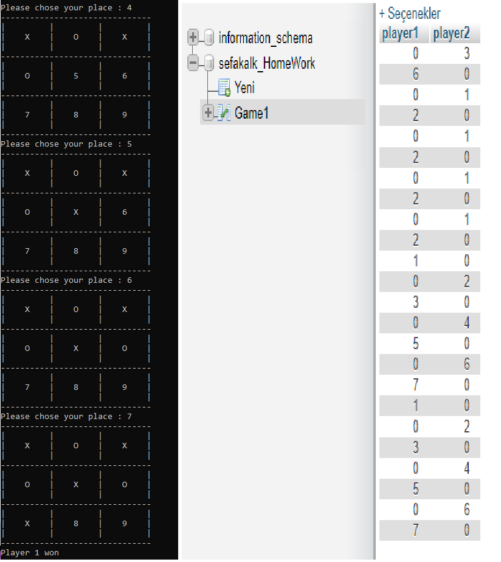

The improved and SQL connected version of my other github project at :
https://github.com/OfficalOffical/WhileStudent/tree/master/C%20%26%20C%2B%2B/ForCV/Tic-Tac-Toe%20Game

You can play TicTacTeo game in C++ compiler :

It will be improved

